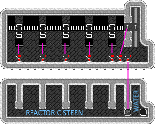

## Dwarven Reactor
A simple machine that generates infinite power!

### Power Usage by Machine Type
For more information on each type of machine, see the [DFwiki](https://dwarffortresswiki.org/index.php/DF2014:Machine_component).

| Machine     | Power Required | Power Generated |
| ----------- | -------------- | --------------- |
| Axle        | 1 per tile     | N / A           |
| Gear        | 5              | N / A           |
| Screw Pump  | 5              | N / A           |
| Water Wheel | 10             | 100             |
| Windmill    | N / A          | 40, 20, or 0    |
| Millstone   | 10             | N / A           |

## Water Wheel Reactor
Design comes straight from the [DFwiki](https://dwarffortresswiki.org/index.php/DF2014:Water_wheel#Dwarven_Water_Reactor), although I have modified it to produce more power and be a bigger footprint. In practice, building this should be on its own 2 z-levels and you would then use gears and axles to "pipe" the power where you need it.

This reactor pod has a net power generation of 845. The design has these elements:

- A reservoir of water underneath the power-generation floor
	- Optionally, connect the reservoirs up to a water pipe to make filling/refilling the reservoirs easy
- A central power axle
- A gear assembly to the reactor chamber. This can be connected to a lever to turn off power output from this reactor pod.
- Some hollowed out floor area to let water generate power
- An intake hole for the screw pump. These can have floor hatches on them attached to levers to turn on/off power generation for that pair of waterwheels.
- A series of water wheel - screw pump (south -> north) - waterwheel