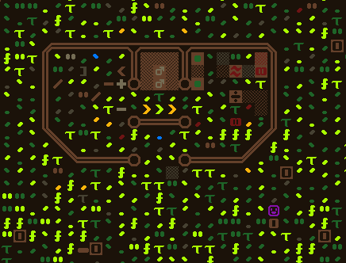

# musarral "Knownsilvers"

Inspired by the embark profile "Escort and 6 nobles with no skills," I'm going to do that but with
1 guard, 1 worker and 5 nobles with no [useful] skills. I'm also going to forbid my nobles from
doing "peasant labors" (cleaning, construction removal, furniture hauling, push/haul vehicles, refuse
hauling, stone hauling, water hauling and wood hauling).

Nobles:

- Politician
- Clerk
- Stringed instrumentalist
- Writer / Poet
- Comedian

Escorts:

- Axedwarf guard with some experience
- Jack-of-all-trades labor dwarf

## saved profile

```ini
[PROFILE]
	[TITLE:Guard, Butler and 5 Nobles with no skills]
	[SKILL:1:MINING:1]
	[SKILL:1:CARPENTRY:1]
	[SKILL:1:MASONRY:1]
	[SKILL:1:BREWING:1]
	[SKILL:1:COOK:1]
	[SKILL:1:PLANT:1]
	[SKILL:1:HERBALISM:1]
	[SKILL:1:WOODCRAFT:1]
	[SKILL:1:STONECRAFT:1]
	[SKILL:1:BEEKEEPING:1]
	[SKILL:2:WOODCUTTING:1]
	[SKILL:2:AXE:1]
	[SKILL:2:DIAGNOSE:1]
	[SKILL:2:CONCENTRATION:1]
	[SKILL:2:DISCIPLINE:1]
	[SKILL:2:SITUATIONAL_AWARENESS:1]
	[SKILL:2:LEADERSHIP:1]
	[SKILL:2:TEACHING:1]
	[SKILL:2:DODGING:1]
	[SKILL:2:MILITARY_TACTICS:1]
	[SKILL:3:CONVERSATION:2]
	[SKILL:3:COMEDY:2]
	[SKILL:4:WRITING:1]
	[SKILL:4:PROSE:1]
	[SKILL:4:READING:1]
	[SKILL:5:ORGANIZATION:1]
	[SKILL:5:LYING:1]
	[SKILL:5:FLATTERY:1]
	[SKILL:5:PACIFY:1]
	[SKILL:5:SPEAKING:1]
	[SKILL:5:INTRIGUE:1]
	[SKILL:6:JUDGING_INTENT:1]
	[SKILL:6:APPRAISAL:1]
	[SKILL:6:RECORD_KEEPING:1]
	[SKILL:7:MAKE_MUSIC:2]
	[SKILL:7:PLAY_STRINGED_INSTRUMENT:2]
	[ITEM:1:WEAPON:ITEM_WEAPON_PICK:INORGANIC:COPPER]
	[ITEM:60:DRINK:NONE:PLANT_MAT:POD_SWEET:DRINK]
	[ITEM:5:SEEDS:NONE:PLANT_MAT:MUSHROOM_HELMET_PLUMP:SEED]
	[ITEM:5:SEEDS:NONE:PLANT_MAT:GRASS_TAIL_PIG:SEED]
	[ITEM:5:SEEDS:NONE:PLANT_MAT:GRASS_WHEAT_CAVE:SEED]
	[ITEM:5:SEEDS:NONE:PLANT_MAT:POD_SWEET:SEED]
	[ITEM:5:SEEDS:NONE:PLANT_MAT:BUSH_QUARRY:SEED]
	[ITEM:5:SEEDS:NONE:PLANT_MAT:MUSHROOM_CUP_DIMPLE:SEED]
	[ITEM:15:MEAT:NONE:CREATURE_MAT:REINDEER:SPLEEN]
	[ITEM:15:FISH:NONE:FISH_BULLHEAD_BLACK:MALE]
	[ITEM:15:PLANT:NONE:PLANT_MAT:MUSHROOM_HELMET_PLUMP:STRUCTURAL]
	[ITEM:5:THREAD:NONE:PLANT_MAT:GRASS_TAIL_PIG:THREAD]
	[ITEM:5:CLOTH:NONE:PLANT_MAT:GRASS_TAIL_PIG:THREAD]
	[ITEM:5:BOX:NONE:PLANT_MAT:GRASS_TAIL_PIG:THREAD]
	[ITEM:3:CHAIN:NONE:PLANT_MAT:GRASS_TAIL_PIG:THREAD]
	[ITEM:3:BUCKET:NONE:PLANT_MAT:CEDAR:WOOD]
	[ITEM:3:SPLINT:NONE:PLANT_MAT:CEDAR:WOOD]
	[ITEM:3:CRUTCH:NONE:PLANT_MAT:CEDAR:WOOD]
	[ITEM:1:TOOL:ITEM_TOOL_WHEELBARROW:PLANT_MAT:CEDAR:WOOD]
	[ITEM:1:TOOL:ITEM_TOOL_STEPLADDER:PLANT_MAT:CEDAR:WOOD]
	[ITEM:1:WEAPON:ITEM_WEAPON_AXE_BATTLE:INORGANIC:IRON]
	[ITEM:1:ARMOR:ITEM_ARMOR_BREASTPLATE:INORGANIC:IRON]
	[ITEM:1:DRINK:NONE:PLANT_MAT:MUSHROOM_HELMET_PLUMP:DRINK]
	[ITEM:1:DRINK:NONE:PLANT_MAT:GRASS_TAIL_PIG:DRINK]
	[PET:2:BIRD_CHICKEN:FEMALE:STANDARD]
```

## game plan

hunker down, get started soon on fort proper -- have some new ideas on fort layout to try.

## beginning notes

The comedian noble was chosen for expedition leader. Also the writer and muscian got
peasant professions so I have customized them respectively. I disabled the labors which
were beneath the nobles.

We embarked to The Torrid Forest on the Shattered Continent. A half day's travel south is a
friendly elven site. A half day north is another one. An elven retreat is 2 days travel west
of us. 2 days travel south of us is a lot of different sites, populated by dwarves, humans
and gobins -- they all have a green border so they could all be part of the human/dwarven civ.
There also are some sites with no population but with artifacts. And there were very few sites
I saw that had more than 50 population. I think this time we're ripe to make a museum and grand
library.

> 7th Slate, 1050: The forest retreat of Leapedtongue (1/2 days travel to the southwest) looks to
> your thriving economy for its future prosperity.

Strange considering it's been a month and all we've done is put a roof over the wagon and butchery
area and started digging a storage pit.



> 9th Felsite, 1050: The forest retreat of Drunkencrushed (1/2 days travel to the south) looks to
> your thriving economy for its future prosperity.

All we've accomplished since Slate is building a carpenter and craftdwarf workshop, and finished
digging out a small room in the stone.

> 5th Hematite, 1050: The forest retreat of Spinsings (a short walk to the southwest) looks to
> your thriving economy for its future prosperity.

> 10th Hematite, 1050: The forest retreat of Gulfbries (a short walk to the southwest) looks to
> your thriving economy for its future prosperity.

All of these economically-linked sites are Elven.

> 4th Malachite, 1050: Migrants have arrived. (4 dwarf citizens)

Finally some more workers! 2 blacksmiths, a doctor and a stonecrafter.

> 5th Malachite, 1050: The forest retreat of Poetfells (a short walk to the southwest) looks to
> your thriving economy for its future prosperity.

> 13th Malachite, 1050: The forest retreat of Sandalmeadow (a short walk to the southwest) looks to
> your thriving economy for its future prosperity.

> 19th Galena, 1050: The forest retreat of Glimmmeredhoods (1/2 days travel to the northwest) looks to
> your thriving economy for its future prosperity.

> 7th Limestone, 1050: The forest retreat of Glosspaths (a short walk to the west) looks to
> your thriving economy for its future prosperity.

A caravan arrived on the 15th of Limestone, 1050. No outpost liason arrived with it. We traded them
some wooden cups, stone mugs and a couple earthenware statues for a gold bar, a few birds, and some
fish and meat.

> 24th Sandstone, 1050: Migrants have arrived. (11 dwarf citizens)

More migrants. Basically they double our population! Noteworthy members are a high master woodcrafter and
a high master gem cutter.

In spring 1051, elven traders arrived and so did a migrant wave of 11 dwarf citizens.
