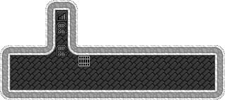

# Hen Houses
How to organize your poultry for easy access and containment.

## The Egg-Egg
This design is shaped like an egg, so I named it the egg-egg. It spans 2 z-levels with the nestboxes below the access stair.

### Hen House Portion

This is a 6x6 circle, with an upstair carved in one of the middle squares. You are able to comfortably put 20 nest boxes inside of this with some breathing room. You can do individual pasture zones for each nestbox and assign a female, then do a pasture zone which includes the entire circle for the males. Or you can do a single large pasture zone and put all the male and females into it. Or perhaps make two zones, one the entire size and one half size and restrict the male to half the area. This could let you get fertilized eggs on half the egg-egg and regular eggs on the other half.

### Access Stair and Cage

The access is above (or you could put it below) the egg-egg. The doors should be closed tightly to prevent a mass chick exodus when they hatch. The cage is there to house all the chicks in after they hatch. This makes things less crowded in the egg-egg and gives your butcher easy access to the poultry once they grow up. When you get the message that blue peachicks have hatched, view the building details of the cage and assign all the new peachicks to it, your animal-hauling dwarves will do the rest.

When it's time to butcher the grown blue peafowl, simply go to the status screen and view the animals. Your oldest (earliest joined) animals are at the top of the list. Blue peafowl will [live for at least a decade](https://dwarffortresswiki.org/index.php/DF2014:Blue_peafowl), so you can make use of the starting batch for a lot of offspring. I tend to start at the top and scroll down the list until I get through as many cocks and hens that I want, then start giving the butchering order on all the other grown birds.

They don't provide a ton of leather per bird but make up for it with 1 year maturation and large clutches.

