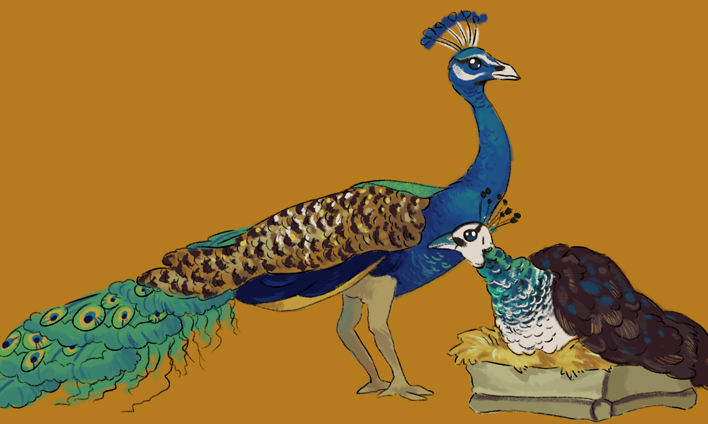

# Prepare for the journey carefully
A few different flavors of embarking:

- [Military dwarf start](#military-squad)
- [Custom "Useless Nobles + Escort" scenario](#nobles-with-escort)
- ["Peacock Easy Start"](#peacock-easy-start)

A custom [embark_profiles.txt](embark_profiles.txt) is available with these profiles.

## Military Squad
Embark with a squad of military dwarves and their commander. 

### Summary

- 2 hammerdwarves
- 2 speardwarves 
- 2 axedwarves
- 1 commander
- steak, spinach, fish and mushrooms
- bunch of beer and wine
- anvil and single magma-safe stone
- 8 coke, 5 iron and 3 silver bars.
- hospital requirements as possible
- logs enough for beds and an armor stand

### How to Use

The hammerdwarves, axedwarves, and speardwarves all also have points in student, concentration and discipline; meanwhile, the commander has points in dodger, shield user, tactician, leader and teacher. The idea is you set up a squad for the first couple seasons with all the dwarves and let them learn some dodging/shield usage. Then split them up into weapon-squads to prevent a ton of cross training.

Have one of your starting 7 forge your tools after building a metalsmith forge with the stone and anvil. Included in the profile is 8 fuel and enough iron for 1 pick, 2 spears and 2 axes and enough silver for 3 war hammers. This was cheaper than bringing the weapons and has the benefit of a random chance for a quality modifier.

The included wood can save time chopping down trees, or allow you to embark somewhere without trees. Make a carpenter shop and produce 7 beds and an armor stand. Set up bedrooms for each dwarf and create a barracks where they all are able to train. You should remember that you get 3 wood from deconstructing the wagon and consider using it for a table and two chairs: one chair becomes an office for your bookkeeper, the chair and table become a bare-bones dining hall.

This start probably benefits the most from migrant waves, as you will get a really solid military foundation. 

You should consider that no one will have armor. And they will only have shields if you make them for them. It's best to get them armored as soon as possible, because it will make a huge improvement for their survival.

## Nobles with Escort
Embark with a handful of nobles and a single escort.

## Peacock Easy Start

Embark with a "generic" start, multiple labor dwarves and regular supplies but also with blue peafowl.