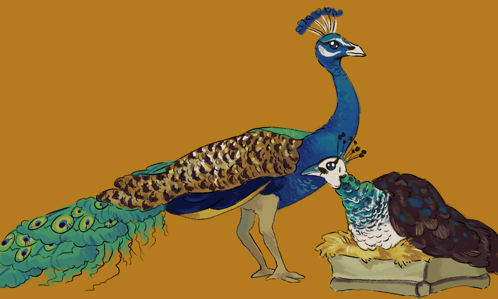

# Prepare for the journey carefully
A few different flavors of embarking:

- [Military dwarf start](#military-squad)
- [Custom "Useless Nobles + Escort" scenario](#nobles-with-escort)
- ["Peafowl Easy Start"](#peafowl-easy-start)

A custom [embark_profiles.txt](peafowl_profiles.txt) is available with these profiles.

## Military Squad
Embark with a squad of military dwarves and their commander. 

### Summary

- 2 hammerdwarves
- 2 speardwarves 
- 2 axedwarves
- 1 commander
- steak, spinach, fish and mushrooms
- bunch of beer and wine
- anvil and single magma-safe stone
- 8 coke, 5 iron and 3 silver bars.
- hospital requirements as possible
- logs enough for beds and an armor stand

### Usage Tips

The hammerdwarves, axedwarves, and speardwarves all also have points in student, concentration and discipline; meanwhile, the commander has points in dodger, shield user, tactician, leader and teacher. The idea is you set up a squad for the first couple seasons with all the dwarves and let them learn some dodging/shield usage. Then split them up into weapon-squads to prevent a ton of cross training.

Have one of your starting 7 forge your tools after building a metalsmith forge with the stone and anvil. Included in the profile is 8 fuel and enough iron for 1 pick, 2 spears and 2 axes and enough silver for 3 war hammers. This was cheaper than bringing the weapons and has the benefit of a random chance for a quality modifier.

The included wood can save time chopping down trees, or allow you to embark somewhere without trees. Make a carpenter shop and produce 7 beds and an armor stand. Set up bedrooms for each dwarf and create a barracks where they all are able to train. You should remember that you get 3 wood from deconstructing the wagon and consider using it for a table and two chairs: one chair becomes an office for your bookkeeper, the chair and table become a bare-bones dining hall.

This start probably benefits the most from migrant waves, as you will get a really solid military foundation. 

You should consider that no one will have armor. And they will only have shields if you make them for them. It's best to get them armored as soon as possible, because it will make a huge improvement for their survival.

## Nobles with Escort
Embark with a handful of nobles and a single escort.

### Summary

- 1 musician
- 1 poet
- 1 scholar
- 1 clerk
- 1 politician
- 1 trader
- 1 jack-of-all trades
- seeds, mushrooms, and steak
- goat cheese
- wine and beer
- chickens, geese, dogs and cats
- an instrument (**Note: choose an instrument that your musician has skill in. You can view the instruments in the symbol creation menu. Adjust his 2nd skill to the type of instrument: string, wind, percussion etc**)
- a couple fancy goblets
- a few nuggets of silver
- silk cloth

### Usage Tips

## Peafowl Easy Start

Embark with a more "generic" start, multiple labor dwarves and regular supplies but also with blue peafowl (and a couple sow for milking; I guess this is more of a food/drink focus embark). This embark will enable you to get your food and drink industry off to a strong start.

### Summary

- blue peafowl
- 2 picks, 1 axe
- anvil
- thread, cloth, rope
- sand
- gypsum plaster
- lye
- buckets
- seeds, fruits, steaks, milk and fish
- beer and wine
- 2 farmers
- 2 miners
- 1 carpenter
- 1 craftdwarf
- 1 mason/broker
- pigs (for milking/cheesemaking)

### Usage Tips

All the animals brought along do not need to graze (except for your pack animals). It would be beneficial to butcher your pack animals and use the tallow to make soap to have from the beginning. You can easily fully stock a hospital and make a well with this start.

To improve your farmers, you should change the general orders to only permit farmers to harvest so they really rake in the growing xp (which affects the food gained from farm plots).

I tried to include a couple fruits from the garden vegetable category, to provide some wine variety. They may not be available if you chose this embark, so consider adding some which are available to you.

Brought some milk (it's only 1 dwarfbuck per unit!) to make some cheese right after arriving as well. That's easy food. With the sows, you can throw them in a room with a farmer's workshop and queue up *x* milking jobs per month, where *x* is the number of sows.

Make sure to make some nest boxes and create some [peafowl coops](poultry-housing.md).
